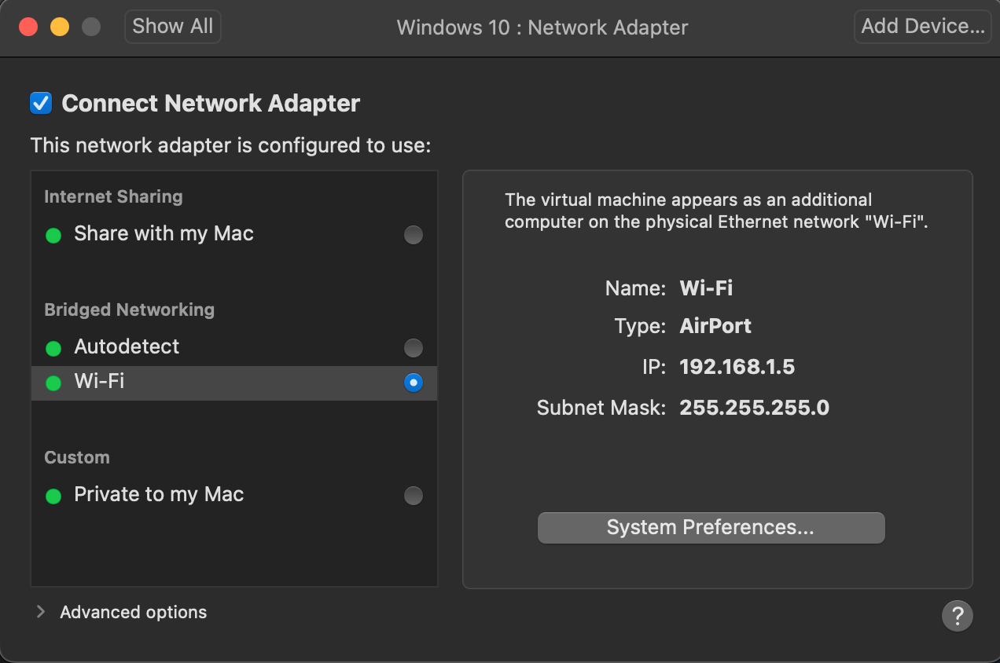
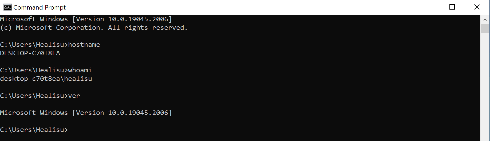

# SOC Home Lab

## Objective

Build a controlled home lab to practise Windows log collection,
authentication analysis, process investigation, and evidence-based reporting.

This is a learning environment. It does not represent a production SOC.

## Lab Environment

| Component | Details |
|---|---|
| Host | MacBook Air |
| Virtualization | VMware Fusion |
| Guest operating system | Windows 10 |
| Windows hostname | DESKTOP-C70T8EA |
| Investigation tool | Windows Event Viewer |
| Lab accounts | Healisu and soclab |
| Network mode | Bridged networking |

## Lab Architecture

The MacBook Air runs a Windows virtual machine through VMware Fusion.

Activity performed inside the Windows VM generates logs. I review those
logs in Event Viewer and use relevant records to build investigation
timelines and reports.

Microsoft Sentinel and centralized log collection are planned additions.

## Log Sources Used

- Windows Security log:
  - 4624 — successful logon
  - 4625 — failed logon
  - 4688 — process creation
- Microsoft-Windows-PowerShell/Operational:
  - 4104 — PowerShell script-block text

## Logging Configuration

During the exercises, I enabled and verified:

- Successful and failed logon auditing.
- Successful process creation auditing.
- Command-line inclusion in process creation events.
- PowerShell script-block logging.

Evidence of these settings is included in the related investigation projects.

## Investigation Workflow

1. Define the activity or question being investigated.
2. Find relevant events on the correct host and within the relevant time range.
3. Identify accounts, logon sessions, processes, and available source information.
4. Correlate records using appropriate identifiers and timestamps.
5. Evaluate legitimate and suspicious explanations.
6. Document findings, uncertainty, and any recommended next steps.

These exercises currently use manual event review. An event does not
automatically generate an alert, and suspicious activity alone does not
prove a security incident.

## Skills Practised

- Reading Windows authentication and process events.
- Distinguishing the initiating account from the target account.
- Correlating logon sessions and process activity.
- Converting hexadecimal and decimal process IDs.
- Connecting PowerShell process creation to script-block records.
- Building timelines and writing investigation reports.

## Lab Setup Evidence

### VMware Network Configuration

The Windows VM uses bridged networking.

### Windows VM Details

Command output confirms:

- Hostname: DESKTOP-C70T8EA
- Current account: desktop-c70t8ea\healisu
- Windows version: 10.0.19045.2006

## Related Projects

- [Windows Event Log Investigation](../02-Windows-Event-Logs/)
- [Controlled Failed-Login Investigation](../03-Brute-Force-Investigation/)

Further planned projects cover network analysis, DNS, phishing,
Microsoft Sentinel, KQL detections, and a simulated incident investigation.

## Limitations

- This is a single Windows VM, not an enterprise network.
- The exercises use controlled, authorized activity.
- Collected events depend on the logging settings enabled at the time.
- Script-block logs record code, not necessarily its output or successful completion.
- These projects demonstrate lab practice, not professional SOC employment.

## Authorized Use

All test activity is limited to systems I own or am explicitly authorized
to use for training.
