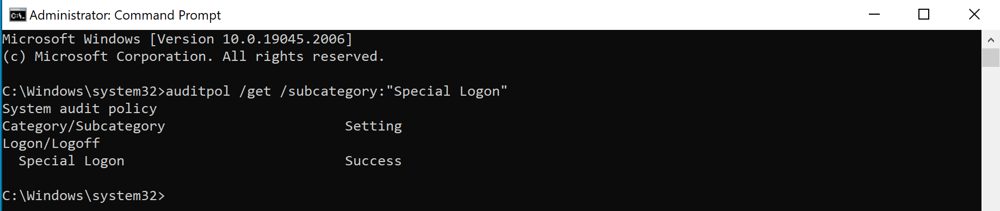
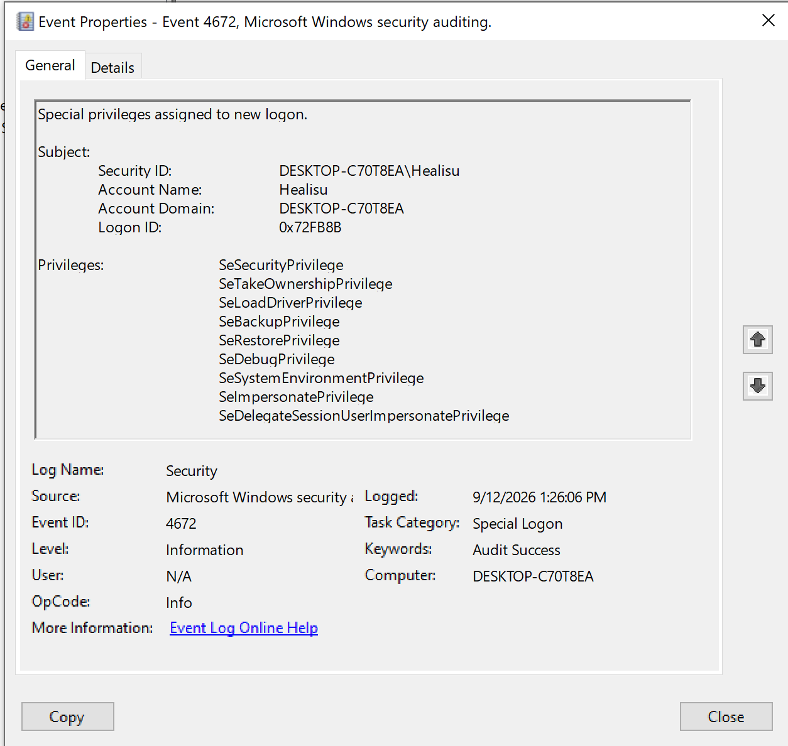
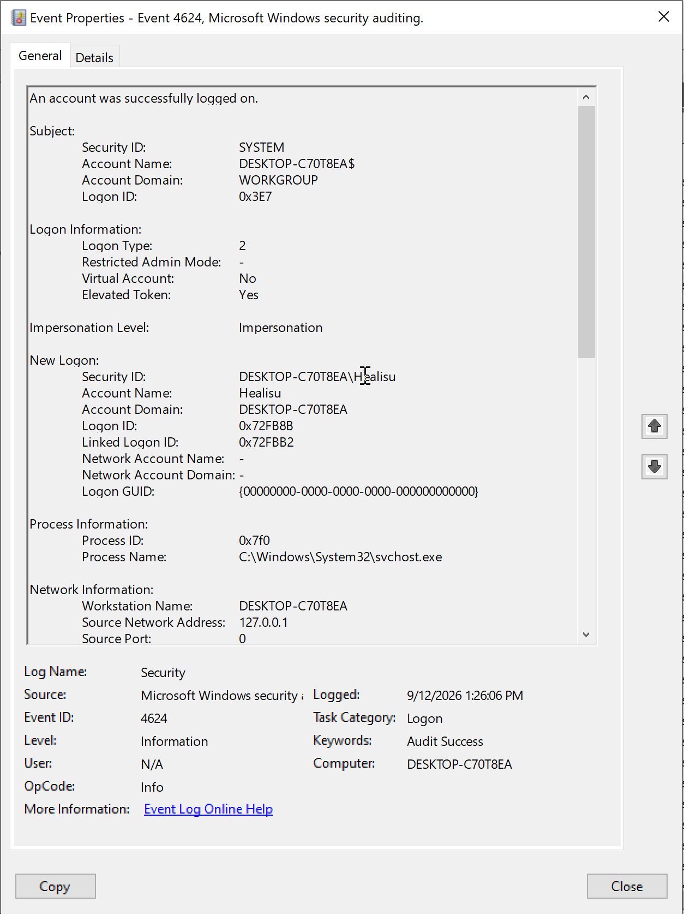
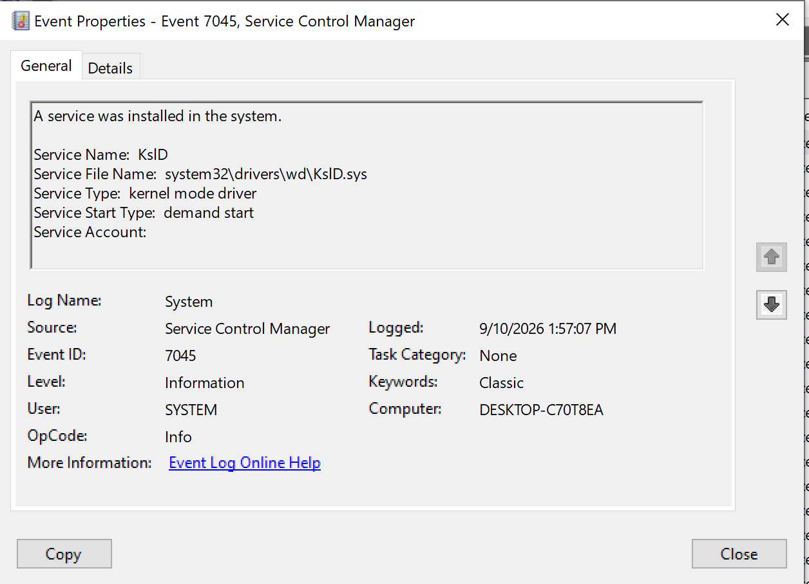

# Privileged Logon and Service Installation Investigation

## Objective

Understand two Windows logging scenarios:

1. Correlate a successful logon with the sensitive privileges assigned
   to its session.
2. Interpret a service-installation event.

These are separate examples. No relationship between the September 10
installation and September 12 login was established.

## Environment

- Windows 10 VM in VMware Fusion.
- Computer: DESKTOP-C70T8EA.
- Investigation tool: Windows Event Viewer.
- Log sources: Security and System.
- Local timestamps: UTC+05:00.

## Example 1: Successful Logon and Special Privileges

### Procedure

1. Checked the Special Logon audit policy:

   `auditpol /get /subcategory:"Special Logon"`

2. Confirmed that the setting was Success.
3. Signed out and signed back in as Healisu.
4. Located Event 4672 and the matching Event 4624.

### Evidence

| Field | Successful logon | Special privileges |
|---|---|---|
| Event ID | 4624 | 4672 |
| Log | Security | Security |
| Event Record ID | 17088 | 17090 |
| Local time | 2026-09-12 13:26:06 | 2026-09-12 13:26:06 |
| Account | New Logon: Healisu | Subject: Healisu |
| Logon ID | 0x72FB8B | 0x72FB8B |
| Computer | DESKTOP-C70T8EA | DESKTOP-C70T8EA |

Event 4624 also recorded:

- Logon Type: 2 — interactive.
- Elevated Token: Yes.
- Source Network Address: 127.0.0.1 — local loopback.
- Subject: SYSTEM — the requesting context.
- New Logon account: Healisu — the account logged on.

Event 4672 listed sensitive privileges, including:

- SeSecurityPrivilege
- SeTakeOwnershipPrivilege
- SeLoadDriverPrivilege
- SeBackupPrivilege
- SeRestorePrivilege
- SeDebugPrivilege
- SeSystemEnvironmentPrivilege
- SeImpersonatePrivilege
- SeDelegateSessionUserImpersonatePrivilege

### Correlation

The New Logon ID in 4624 matched the Subject Logon ID in 4672:
0x72FB8B.

The matching host, account SID, and timestamps supported the connection.

### Finding

Healisu successfully logged on, and the matching session received
the listed sensitive privileges. This was consistent with the
controlled sign-out/sign-in exercise.

Event 4672 records privilege assignment. It does not prove that
any listed privilege was subsequently used.

## Example 2: Service Installation

### Procedure

Filtered Windows Logs → System for Event ID 7045 and examined
an existing Service Control Manager record.

This installation was historical activity, not an action generated
during the September 12 exercise.

### Evidence

| Field | Value |
|---|---|
| Event ID | 7045 |
| Log | System |
| Source | Service Control Manager |
| Event Record ID | 948 |
| Local time | 2026-09-10 13:57:07 |
| Computer | DESKTOP-C70T8EA |
| Service name | KslD |
| Service file name | system32\drivers\wd\KslD.sys |
| Service type | Kernel-mode driver |
| Start type | Demand start |
| Service account | Blank |

### Interpretation

Windows recorded the installation of a driver service named KslD.

Demand start describes how the service is configured to start:
it can be started on request. It does not establish that the driver
actually started.

### Finding

The record establishes the service registration and its recorded
configuration. It does not, by itself, establish:

- Whether the driver started.
- Whether the installation was authorized or malicious.
- Which human initiated the installation.
- Any connection to Healisu's September 12 login.

No benign or malicious verdict was reached from this event alone.

## Scope and Limitations

- This report focuses on interpreting the selected events.
- It is not a complete incident investigation.
- Additional service-configuration and signature checks were explored,
  but are outside the scope of this introductory report.
- No SIEM alert was generated for these exercises.
- No containment action was performed.
- No new privileges were deliberately granted to an account, and no
  test service was created during this exercise.

## Lessons Learned

1. Match 4624 New Logon ID to 4672 Subject Logon ID on the same host.
2. Privilege assignment does not prove privilege use.
3. Service installation does not prove service execution.
4. Demand start is a configuration setting, not a running-state indicator.
5. Separate unrelated events instead of forcing them into one incident.

## Screenshots

### Special Logon Audit Policy

### Privileges Assigned to Healisu

### Matching Successful Logon

### Historical Driver Installation

