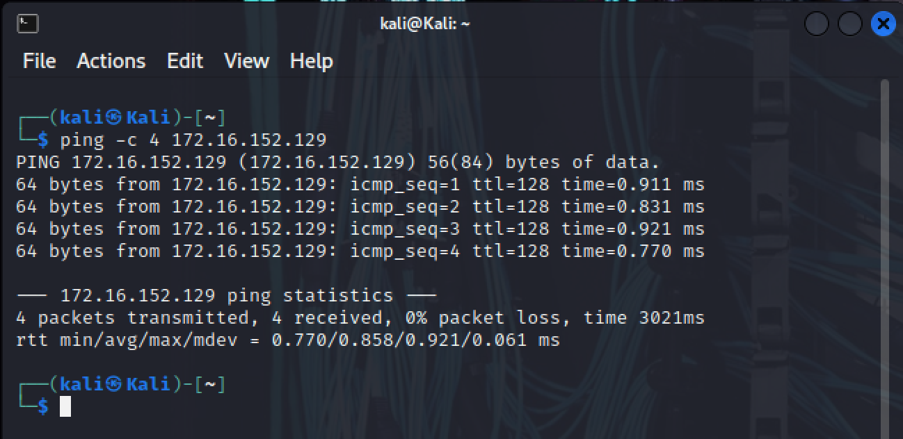
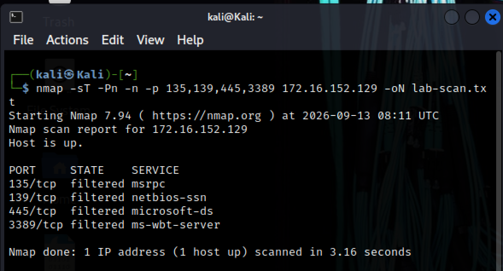
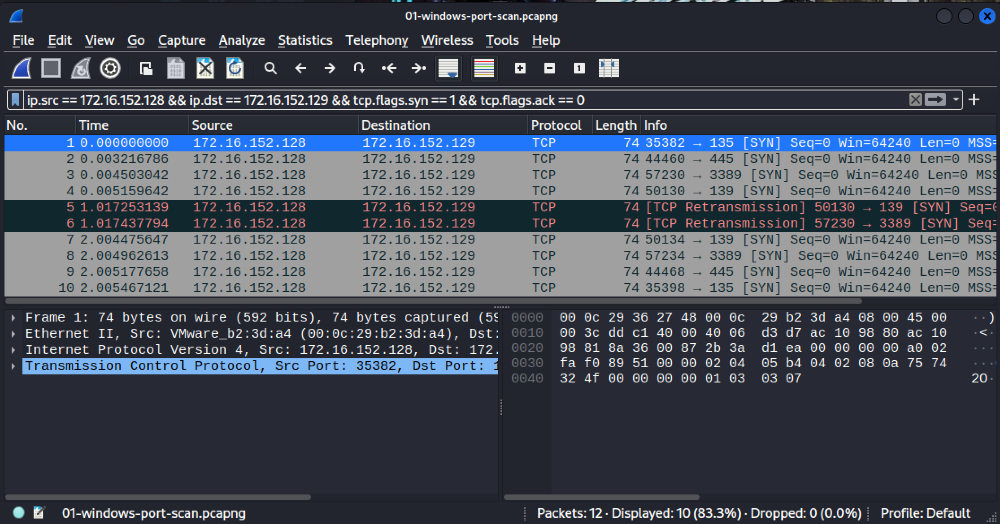
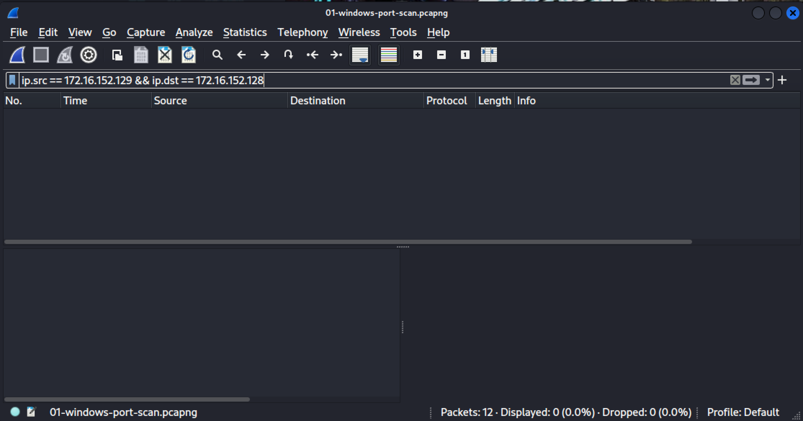
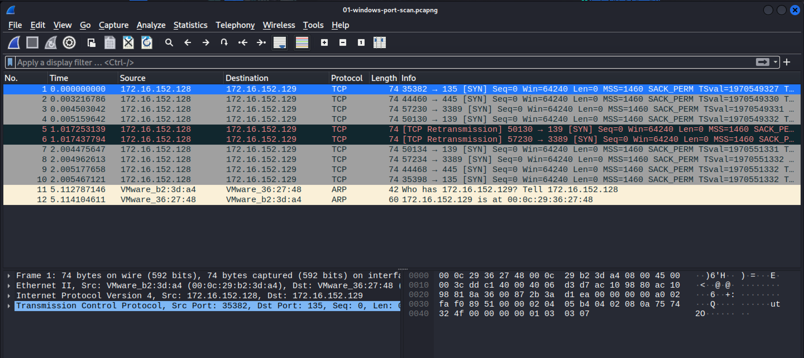

# Nmap Scan Detection and Investigation

## Objective

Generate a controlled TCP port scan against a Windows lab VM and
identify its traffic in Wireshark.

This exercise uses manual packet analysis from the scanning machine.
No automated detection rule or SOC alert was generated.

## Lab Environment

| Component | Details |
|---|---|
| Virtualization | VMware Fusion |
| Network | Private to my Mac |
| Scan source | Kali — 172.16.152.128 |
| Scan target | Windows — 172.16.152.129 |
| Scanner | Nmap 7.94 |
| Packet analysis | Wireshark 4.0.7 |
| Capture interface | Kali eth0 |

Both VMs were configured to use the same private VMware network.
The scan targeted only the Windows lab VM.

## Connectivity Preparation

Initial ping attempts received no replies.

Kali's neighbour table contained a hardware-address entry for Windows.
A Windows Firewall rule was then added to allow inbound ICMPv4 echo
requests specifically from Kali:

    New-NetFirewallRule -DisplayName "SOC-Lab-Ping-From-Kali" -Direction Inbound -Protocol ICMPv4 -IcmpType 8 -RemoteAddress 172.16.152.128 -Action Allow -Profile Any

Ping succeeded afterward. Windows Firewall remained enabled.

This rule permits ping traffic; it does not permit the TCP ports scanned
in this exercise.

## Scan Procedure

Started a Wireshark capture on Kali's eth0 interface with this capture filter:

    host 172.16.152.129

Then ran:

    nmap -sT -Pn -n -p 135,139,445,3389 172.16.152.129 -oN lab-scan.txt

| Option | Purpose |
|---|---|
| -sT | TCP connect scan |
| -Pn | Skip host discovery and attempt the scan |
| -n | Disable DNS resolution |
| -p | Select the four target ports |
| -oN | Save normal text output |

After the scan, stopped and saved the capture.

## Nmap Results

Nmap reported the scan start as September 13, 2026, at 08:11 UTC.
The reported scan duration was 3.16 seconds.

| TCP port | State | Nmap service label |
|---|---|---|
| 135 | filtered | msrpc |
| 139 | filtered | netbios-ssn |
| 445 | filtered | microsoft-ds |
| 3389 | filtered | ms-wbt-server |

Filtered means Nmap could not determine whether the ports were open
or closed.

The service labels are conventional names associated with the port
numbers. They do not prove that those services were running.

Because -Pn was used, the “Host is up” line is not independent proof
that a TCP service responded. Earlier successful ping and the captured
ARP reply provide separate connectivity evidence.

## Packet Analysis

The saved capture contained 12 packets:

- 10 TCP SYN packets from Kali to Windows.
- One ARP request from Kali.
- One ARP reply from Windows.

### TCP Requests

Applied this display filter:

    ip.src == 172.16.152.128 && ip.dst == 172.16.152.129 && tcp.flags.syn == 1 && tcp.flags.ack == 0

The first four packets targeted ports 135, 445, 3389, and 139 within
approximately 5 milliseconds.

Later packets included retries. Wireshark explicitly labelled two
packets as TCP retransmissions.

Ten SYN packets do not mean ten different ports were scanned:
the traffic targeted four distinct destination ports.

### Return IPv4 Traffic

Applied this display filter:

    ip.src == 172.16.152.129 && ip.dst == 172.16.152.128

No packets matched. No TCP replies from Windows were present in
the saved capture.

### ARP Exchange

Clearing the display filter revealed:

- Packet 11: a request asking for the hardware address of 172.16.152.129.
- Packet 12: a reply identifying that address as 00:0c:29:36:27:48.

ARP is not an IPv4 packet, so the previous ip.src filter did not
display this reply.

Windows responded to local address resolution, while no TCP response
to the scan was captured.

## Assessment

One source attempted TCP connections to four ports on one destination
in a short time interval. This pattern matches the controlled Nmap
command executed during the exercise.

The unanswered SYN requests and filtered scan results are consistent
with silent filtering. The evidence does not establish the exact
location or cause of filtering.

Classification: authorized lab scan.

No compromise was demonstrated. No automated alert was generated.

## SOC Investigation Considerations

If similar traffic appeared in a real environment, an analyst would:

1. Identify the source and destination assets.
2. Check whether the source is an approved scanner.
3. Examine the time window, distinct ports, retries, and responses.
4. Review available target-side firewall and endpoint logs.
5. Check for follow-on connections or other suspicious activity.
6. Document the evidence and escalate according to the organization's procedure.

A scanning pattern alone does not establish malicious intent.

## Limitations

- Only four TCP ports on one host were tested.
- The capture was taken on Kali, not on the Windows target.
- Packets observed leaving Kali do not prove receipt by Windows.
- No target-side firewall logs were examined.
- No successful TCP handshake was observed.
- The actual open or closed state of the filtered ports remains unknown.
- Packet timing alone cannot uniquely identify Nmap.
- This was manual investigation, not a deployed detection capability.

## Original Evidence

- [Nmap output](Logs/lab-scan.txt)
- [Packet capture — open with Wireshark](Logs/01-windows-port-scan.pcapng)

## Screenshots

### Connectivity

### Nmap Results

### TCP SYN Requests

### No Return IPv4 Packets

### Complete Capture

## Cleanup Status

A temporary ping rule was added during setup. Its removal has not
yet been verified.

The VMs were placed on the private VMware network for the exercise.
