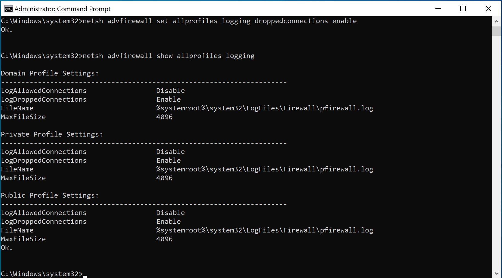
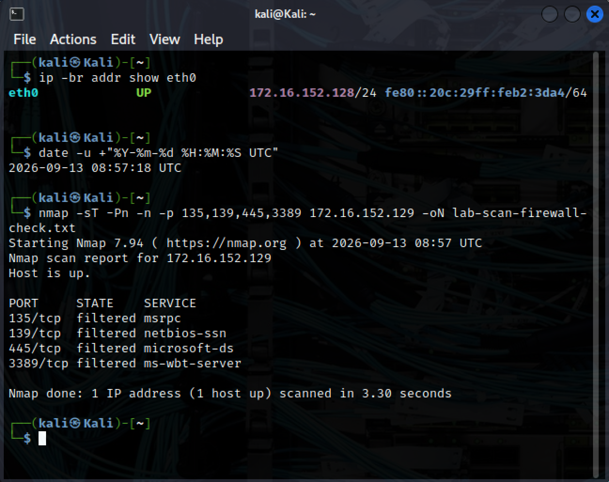
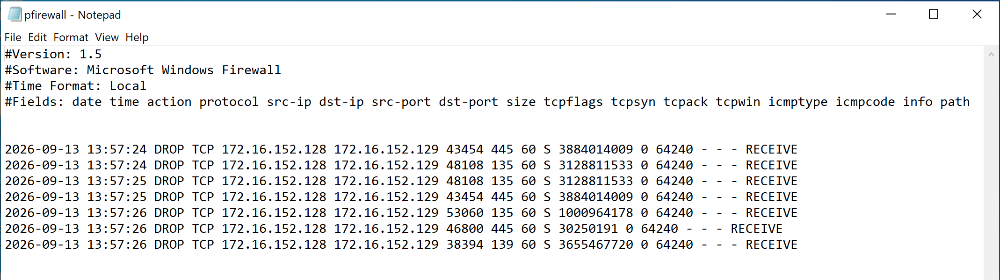

# Nmap Scan Detection and Investigation

## Objective

Generate a controlled TCP port scan against a Windows lab VM,
identify its traffic in Wireshark, and examine Windows Firewall
logs for corresponding dropped packets.

This exercise demonstrates manual investigation.
No automated detection rule or SOC alert was generated.

## Lab Environment

| Component | Details |
|---|---|
| Virtualization | VMware Fusion |
| Network | Private to my Mac |
| Scan source | Kali — 172.16.152.128 |
| Scan target | Windows — 172.16.152.129 |
| Scanner | Nmap 7.94 |
| Packet analysis | Wireshark 4.0.7 |
| Capture interface | Kali eth0 |
| Target-side evidence | Windows Firewall text log |

Both VMs used the same private VMware network.
The scans targeted only the Windows lab VM.

## Connectivity Preparation

Initial ping attempts received no replies.

Kali's neighbour table contained a hardware-address entry for Windows.
A Windows Firewall rule was then added to allow inbound ICMPv4 echo
requests specifically from Kali:

    New-NetFirewallRule -DisplayName "SOC-Lab-Ping-From-Kali" -Direction Inbound -Protocol ICMPv4 -IcmpType 8 -RemoteAddress 172.16.152.128 -Action Allow -Profile Any

Ping succeeded afterward. Windows Firewall remained enabled.

This rule permits ping requests from the specified IP address.
It does not permit connections to the TCP ports scanned in this exercise.

## Investigation Overview

Two separate scans were performed on September 13, 2026.

| Run | Evidence collected | Purpose |
|---|---|---|
| First scan, 08:11 UTC | Nmap output and Kali-side packet capture | Observe connection requests and responses |
| Repeat scan, 08:57 UTC | New Nmap output and Windows Firewall log | Check whether Windows recorded dropped scan traffic |

The packet capture belongs to the first scan.
It was not used as a packet-by-packet record of the repeat scan.

## First Scan: Procedure

Started a Wireshark capture on Kali's eth0 interface with this capture filter:

    host 172.16.152.129

Then ran:

    nmap -sT -Pn -n -p 135,139,445,3389 172.16.152.129 -oN lab-scan.txt

| Option | Purpose |
|---|---|
| -sT | Perform a TCP connect scan |
| -Pn | Skip host discovery and attempt the scan |
| -n | Disable DNS resolution |
| -p | Select the four target ports |
| -oN | Save normal text output |

After the scan, stopped the capture and saved it as:

    01-windows-port-scan.pcapng

## First Scan: Nmap Results

Nmap reported the scan start as September 13, 2026, at 08:11 UTC.
The reported scan duration was 3.16 seconds.

| TCP port | State | Nmap service label |
|---|---|---|
| 135 | filtered | msrpc |
| 139 | filtered | netbios-ssn |
| 445 | filtered | microsoft-ds |
| 3389 | filtered | ms-wbt-server |

Filtered means Nmap could not determine whether the ports were open
or closed.

The service labels are conventional names associated with the port
numbers. They do not prove that those services were running.

Because -Pn was used, the “Host is up” line is not independent proof
that a TCP service responded. Earlier successful ping and the captured
ARP reply provide separate connectivity evidence.

## First Scan: Packet Analysis

The saved capture contained 12 packets:

- 10 TCP SYN packets from Kali to Windows.
- One ARP request from Kali.
- One ARP reply from Windows.

The packet times below are relative to the first captured packet.

### TCP Connection Requests

Applied this display filter:

    ip.src == 172.16.152.128 && ip.dst == 172.16.152.129 && tcp.flags.syn == 1 && tcp.flags.ack == 0

The first four packets targeted ports 135, 445, 3389, and 139 within
approximately 5 milliseconds.

Later packets included retries. Wireshark explicitly labelled two
packets as TCP retransmissions.

Ten SYN packets do not mean ten different ports were scanned.
The requests targeted four distinct destination ports.

### Return IPv4 Traffic

Applied this display filter:

    ip.src == 172.16.152.129 && ip.dst == 172.16.152.128

No packets matched. No TCP replies from Windows were present in
the saved capture.

This observation applies only to the capture window and capture point.

### ARP Exchange

Clearing the display filter revealed:

- Packet 11, approximately 5.113 seconds after the first packet:
  Kali requested the hardware address associated with 172.16.152.129.
- Packet 12, approximately 5.114 seconds after the first packet:
  an ARP reply identified that address as 00:0c:29:36:27:48.

ARP is not an IPv4 packet, so the previous ip.src filter did not
display this reply.

The ARP exchange showed local address resolution working.
It did not establish that the scanned TCP ports were reachable.

## Repeat Scan: Windows Firewall Logging

### Initial Logging Settings

Checked the configuration from an administrator Command Prompt:

    netsh advfirewall show allprofiles logging

Dropped-packet logging was disabled for the Domain, Private,
and Public profiles.

The configured log location was:

    %systemroot%\System32\LogFiles\Firewall\pfirewall.log

### Enable Dropped-Packet Logging

Ran:

    netsh advfirewall set allprofiles logging droppedconnections enable

Verified the settings again:

    netsh advfirewall show allprofiles logging

LogDroppedConnections showed Enable for all three profiles.
LogAllowedConnections remained disabled.

This changed logging settings, not the rules deciding which
connections were permitted.

Enabling logging could not recover dropped-packet records
from the first scan.

### Repeat Scan Command

Confirmed the VM IP addresses were unchanged.

Recorded a pre-scan UTC timestamp:

    date -u +"%Y-%m-%d %H:%M:%S UTC"

Output:

    2026-09-13 08:57:18 UTC

Then ran:

    nmap -sT -Pn -n -p 135,139,445,3389 172.16.152.129 -oN lab-scan-firewall-check.txt

The timestamp was recorded before the command; it is not the
precise time of the first scan packet.

Nmap again reported all four ports as filtered.
The reported scan duration was 3.30 seconds.

## Repeat Scan: Windows Firewall Evidence

Opened the firewall log and examined its header and entries.

The header specified:

    #Time Format: Local

Windows used UTC+05:00. Therefore, the observed local timestamps
13:57:24–13:57:26 corresponded to 08:57:24–08:57:26 UTC.

The reviewed evidence contained seven matching dropped-packet entries.

| Windows local time | Source IP | Destination IP | Source port | Destination port | Action |
|---|---|---|---|---|---|
| 13:57:24 | 172.16.152.128 | 172.16.152.129 | 43454 | 445 | DROP |
| 13:57:24 | 172.16.152.128 | 172.16.152.129 | 48108 | 135 | DROP |
| 13:57:25 | 172.16.152.128 | 172.16.152.129 | 48108 | 135 | DROP |
| 13:57:25 | 172.16.152.128 | 172.16.152.129 | 43454 | 445 | DROP |
| 13:57:26 | 172.16.152.128 | 172.16.152.129 | 53060 | 135 | DROP |
| 13:57:26 | 172.16.152.128 | 172.16.152.129 | 46808 | 445 | DROP |
| 13:57:26 | 172.16.152.128 | 172.16.152.129 | 38394 | 139 | DROP |

All seven entries recorded:

- Protocol: TCP.
- TCP flags: S — SYN.
- Path: RECEIVE — incoming traffic.

The matching source, destination, target ports, and time window
support associating these entries with the controlled repeat scan.

### Comparison with Nmap

| Target TCP port | Repeat Nmap result | Matching Windows DROP entry found |
|---|---|---|
| 135 | filtered | Yes |
| 139 | filtered | Yes |
| 445 | filtered | Yes |
| 3389 | filtered | No |

Windows Firewall explicitly recorded dropping traffic to ports
135, 139, and 445.

No matching 3389 entry was found in the reviewed log.
The reason for its absence was not established.

A missing log entry does not prove that traffic was allowed.

## Assessment

The first scan demonstrated connection requests to four distinct
ports on one Windows host, including retries and no captured TCP replies.

The repeat scan added target-side evidence: Windows Firewall recorded
dropping incoming TCP SYN packets from Kali to three of the scanned ports.

This strengthens the filtering assessment for the repeat scan.
It does not establish the exact handling of port 3389 or retrospectively
prove how every packet from the first scan was handled.

Classification: authorized lab scanning.

No compromise was demonstrated.
No automated alert was generated.

## SOC Investigation Considerations

If similar traffic appeared in a real environment, an analyst would:

1. Identify the source and destination assets.
2. Check whether the source is an approved scanner.
3. Examine the time window, distinct destination ports, retries, and responses.
4. Compare network observations with target-side firewall and endpoint logs.
5. Check for follow-on connections or other suspicious activity.
6. Document findings, evidence gaps, and an escalation decision.

A scanning pattern alone does not establish malicious intent.
Packet timing alone cannot uniquely identify Nmap.

## Limitations

- Only four TCP ports on one host were tested.
- The packet capture belongs to the first scan, while the firewall
  evidence belongs to a separate repeat scan.
- The packet capture was taken on Kali, not on Windows.
- No successful TCP handshake was observed in the first capture.
- Windows DROP entries were found for three ports, not all four.
- The actual open or closed state of the filtered ports remains unknown.
- Firewall timestamps have one-second resolution.
- No automated detection rule was deployed.
- This was a controlled home-lab exercise, not a production incident.

## Original Evidence

### First Scan

- [Nmap output](Logs/lab-scan.txt)
- [Packet capture — open with Wireshark](Logs/01-windows-port-scan.pcapng)

### Repeat Scan

- [Repeat Nmap output](Logs/lab-scan-firewall-check.txt)
- [Windows Firewall log evidence copy](Logs/windows-firewall-scan.log)

## Screenshots

### Connectivity

### First Nmap Scan

### TCP SYN Requests

### No Return IPv4 Packets

### Complete First Capture

### Windows Firewall Logging Enabled

### Repeat Scan

### Windows Firewall Drops

## Final Lab Configuration

- Windows Firewall remains enabled.
- The SOC-Lab-Ping-From-Kali rule was intentionally retained for
  future lab connectivity checks.
- The ping rule allows inbound ICMPv4 echo requests only from
  172.16.152.128. It does not open the scanned TCP ports.
- Dropped-packet logging was left enabled for all three firewall profiles.
- Allowed-connection logging remained disabled.
- The configured maximum firewall log size remained 4096 KB.
- Both VMs remain on the Private to my Mac network.

The ping rule is scoped to an IP address, not a permanent device identity.
Review it if the VM addresses or network configuration change.

## Lessons Learned

1. Successful ping does not mean TCP ports are accessible.
2. Filtered does not mean definitely open or definitely closed.
3. Retries do not represent additional distinct target ports.
4. Display filters can hide relevant traffic, including ARP replies.
5. Target-side logs can strengthen a source-side observation.
6. Logging must be enabled before the activity being investigated.
7. Convert timestamps to a common timezone before correlating evidence.
8. Missing records must be documented rather than treated as proof.
9. Keep evidence from separate scan runs clearly distinguished.
